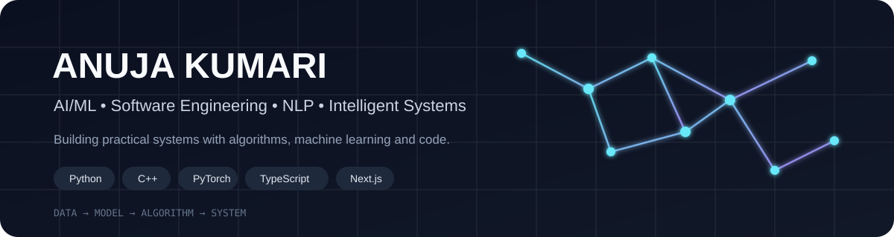

<h2 align="center">Hi, I'm Anuja 👋</h2>

  <b>B.Tech CSE • AI/ML • Software Engineering • NLP</b>

  I enjoy turning algorithms, machine learning and software engineering 
  into practical systems that solve real-world problems.

---

## 🧭 What I Build

- 🤖 **AI / ML** — deep learning, computer vision, NLP and explainable AI
- 🧠 **Research** — studying how reliable and stable ML systems are
- 🗺️ **Algorithms** — routing, graph algorithms and data structures
- 🌐 **Software** — full-stack applications and developer tools
- ♻️ **Intelligent Systems** — applying AI to real-world waste-management problems

---

## 🚀 Featured Projects

<table>
<tr>
<td width="50%" valign="top">

### 🗺️ Naviq

A routing engine built with **Next.js + TypeScript**, exploring multiple shortest-path and graph algorithms.

**Algorithms & concepts**

\`Dijkstra\` \`A*\` \`BFS\` \`Bellman-Ford\` \`KD-Tree\` \`Trie\` \`LRU/LFU Cache\` \`MinHeap\`

<a href="https://github.com/ANUJA-KUMARI/naviq">View repository →</a>

</td>
<td width="50%" valign="top">

### ♻️ AI Waste Segregation

An AI-enabled waste classification and segregation system combining computer vision with intelligent actuation.

**Focus**

\`YOLO\` \`Computer Vision\` \`Classification\` \`Edge AI\`

<a href="https://github.com/ANUJA-KUMARI/AI_SERVO_YOLO_PROJECT">View repository →</a>

</td>
</tr>

<tr>
<td width="50%" valign="top">

### 🧠 NLP Explanation Stability

Researching whether NLP model explanations remain stable when inputs are paraphrased.

**Exploring**

\`BERT\` \`DistilBERT\` \`LIME\` \`SHAP\` \`QQP\` \`PAWS\`

<a href="https://github.com/ANUJA-KUMARI/research-sprint-demo">View repository →</a>

</td>
<td width="50%" valign="top">

### 👁️ Driver Drowsiness

A computer-vision project focused on detecting driver drowsiness and building an alerting workflow.

**Focus**

\`Computer Vision\` \`Python\` \`Deep Learning\`

<a href="https://github.com/ANUJA-KUMARI/Drive-Drowsiness">View repository →</a>

</td>
</tr>
</table>

---

## 🔬 Research

### Stability of NLP Model Explanations Across Real-World Paraphrase Datasets

My current research explores whether explanations generated by NLP models remain consistent when semantically equivalent inputs are paraphrased.

The study uses **QQP and PAWS** and investigates explanation stability with methods such as **LIME and SHAP**, using fine-tuned transformer models including **BERT and DistilBERT**.

> The goal is not simply to improve classification accuracy, but to understand how trustworthy model explanations are under realistic input variation.

---

## 🛠️ My Toolbox

### Languages

### AI / ML

### Development

### Tools

---

## 💡 Currently Exploring

\`\`\`text
Machine Learning
       ↓
Deep Learning ───→ Computer Vision
       ↓
      NLP ────────→ Explainable AI
       ↓
Algorithms ───────→ Intelligent Systems
       ↓
      Software Engineering
\`\`\`

---

## 📊 GitHub

  
  

---

## 🤝 Let's Connect

  <a href="https://github.com/ANUJA-KUMARI">GitHub</a>
  &nbsp; • &nbsp;
  <a href="https://www.linkedin.com/">LinkedIn</a>

  <i>Build. Learn. Experiment. Repeat.</i>

